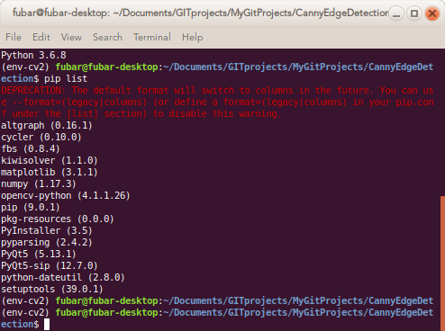

# CannyEdgeDetection
A PyQt5 App based tutorial to understand Canny Edge Detection. I use this algorithm for my thesis work pertaining to ellipse detection of Kerr microscopy images.

#### Exercise:
Write a small application to find the Canny edge detection
whose threshold values can be varied using two trackbars.
This way, you can understand the effect of threshold values.

#### Solution:
Let us use PyQt for the GUI application.

For the image handling in the GUI, use Matplotlib's Qt5 backend.

For the image processing for detecting edges, lets use Canny Edge Detection routines of OpenCV-python module.

---

# Requirements

Create a virtual environment with the following dependencies. If you need to package the app, you need `fbs`, else remove from the below command

	pip install opencv-python matplotlib PyQt5 fbs

## Linux

A repeatable installation with Python version 3.6.8 with the dependencies listed in `requirements-linux.txt` is possible with

 	(env-cv2) $ pip install -r requirements-linux.txt

## Windows

Similarly for Windows with `requirements-windows.txt`

	(env-cv2) $ pip install -r requirements-windows.txt

---

# Preview

---

# Theory

The algorithm was given by John F. Canny in 1986.

It is a multistage algorithm involving

- Noise reduction
- Finding intensity gradient
- Non-maximum suppression
- Hysteresis thresholding

---

# TODO

The app crashes when the filepath does not exist. Need to incorporate exception handling

The freezing of windows version has errors.

---

# References

[Canny Edge Detection using OpenCV](https://opencv-python-tutroals.readthedocs.io/en/latest/py_tutorials/py_imgproc/py_canny/py_canny.html)

[Crop an image in OpenCV](https://stackoverflow.com/questions/15589517/how-to-crop-an-image-in-opencv-using-python)

[Morphological Image Processing](https://stackoverflow.com/questions/30369031/remove-spurious-small-islands-of-noise-in-an-image-python-opencv)

[Embedding Matplotlib in Qt](https://matplotlib.org/gallery/user_interfaces/embedding_in_qt_sgskip.html#sphx-glr-gallery-user-interfaces-embedding-in-qt-sgskip-py)

[Widgets in PyQt5](https://www.riverbankcomputing.com/static/Docs/PyQt5/api/qtwidgets/qtwidgets-module.html)

[Exception handling: File does not exist](https://github.com/mfitzp/15-minute-apps/blob/master/notepad/notepad.py)
